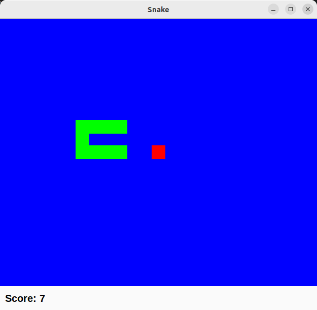

# Go Snake

This is a simple snake game written in Go. 
I wrote it to get familiar with the language.




## Dependencies

The game uses GTK3 for rendering the game window and Cairo for drawing the game elements.
I use the [gotk3](https://github.com/gotk3/gotk3) library to interface with GTK3 and Cairo.

## Compilation

To compile the game, you need to have the GTK3 and Cairo development libraries installed on your system.

On Ubuntu, you can install them with the following command:

```bash
sudo apt-get install libgtk-3-dev libcairo2-dev
```

Given that you have Go installed on your system, you can 
then compile the game with the following command:

```bash
go build
```
